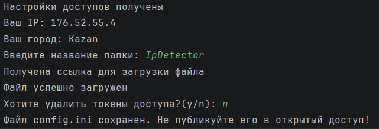

### Курсовая работа «Ip Detector

Программа получает ip пользователя, находит по 
нему город и записывает json файл на Яндекс.Диск с
этими данными.

***Установка***
1. Склонируйте [репозиторий](https://github.com/OttomaniaKazan/ipdetector)
2. В терминале создайте виртуальное окружение
    * python -m venv venv

      source venv/bin/activate  
      Для Windows: venv\Scripts\activate
3. Установите зависимости через команду:
    * pip install -r requirements.txt

Для работы вам понадобятся токены доступа с сайтов:
 * [ipinfo.io](https://ipinfo.io/)
 * [Я.Диск](https://yandex.ru/dev/disk/poligon/)

___Сохраните их в надежном месте и не передавайте с
программой в открытые источники___

## Использование
Запустите основной файл в виртуальной среде. Программа 
интерактивная и для полного выполнения, попросит ввести
нужные данные. Итоговый результат отобразится в ркне терминала
и на вашем Яндекс.Диске

## Структура проекта

- main.py - запуск основной программы
- entities.py - описание классов и методов
- local_func.py - вспомогательные функции
- request_handler - модуль безопасной 
обработки запросов requests
- .gitignore - исключения для открытого доступа
- requirements.txt - Список зависимостей